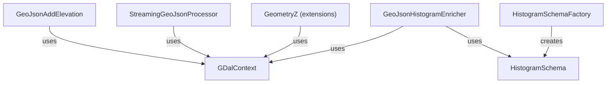

# SpocWeb.GeoJson.Raster

Adds elevation information from Digital Elevation Models (DEM) to GeoJSON files,
and computes per-feature elevation histograms using GDAL raster datasets
such as the Copernicus DEM VRT.

## Classes

| Class | Responsibility | Key Collaborators |
|---|---|---|
| `GDalContext` | Worker-local GDAL and coordinate-transformation context for safe parallel raster sampling. | `GeometryZ`, `GeoJsonHistogramEnricher`, `GeoJsonAddElevation` |
| `GeoJsonAddElevation` | Adds elevation Z coordinates to every geometry in a GeoJSON file using a GDAL raster model. | `GDalContext`, `GeometryZ` |
| `StreamingGeoJsonProcessor` | Low-memory streaming processor that adds Z coordinates to GeoJSON FeatureCollections token-by-token. | `GDalContext`, `GeometryZ` |
| `GeometryZ` | Extension methods that add the Z dimension from an elevation model to any `NetTopologySuite` geometry type. | `GDalContext` |
| `HistogramBin` | Value record describing one bin of a histogram (index, min/max values, label). | `HistogramSchema` |
| `HistogramSchema` | Shared histogram bin definition shared across all features in a processing run. | `GeoJsonHistogramEnricher` |
| `HistogramSchemaFactory` | Creates `HistogramSchema` instances from a range or a width specification. | `HistogramSchema` |
| `GeoJsonHistogramEnricher` | Enriches GeoJSON polygon features with compact per-feature elevation histograms derived from a DEM VRT. | `GDalContext`, `HistogramSchema` |

## Relationships

## Entry Points

| Method | Description |
|---|---|
| `GeoJsonAddElevation.AddElevationAsZ(vrtFile, geoJsonDirectory)` | Adds Z coordinates to all GeoJSON files in a directory tree, updating each file in-place. |
| `StreamingGeoJsonProcessor.StreamGeoJsonProcessor(vrtPath, geoJsonPath)` | Streams elevation-enriched GeoJSON output for a single file without loading it fully. |
| `GeoJsonHistogramEnricher.AddHistogram(vrtFile, geoJsonDirectory)` | Adds compact elevation histograms to all GeoJSON polygon features in a directory tree in parallel. |
| `HistogramSchemaFactory.CreateFromRange(id, min, max, bucketCount)` | Creates a histogram schema from explicit min/max bounds and bucket count. |
| `HistogramSchemaFactory.CreateFromWidth(id, min, bucketCount, width)` | Creates a histogram schema from a starting value and fixed bucket width. |
