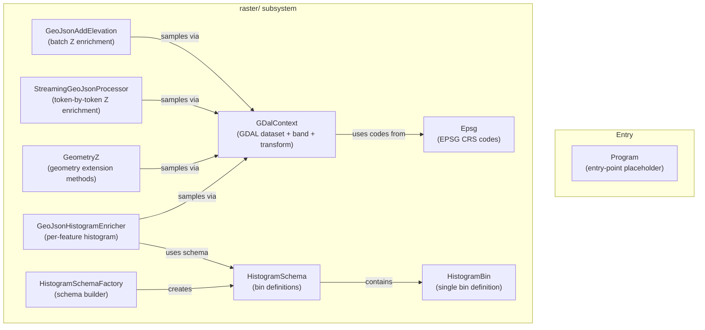
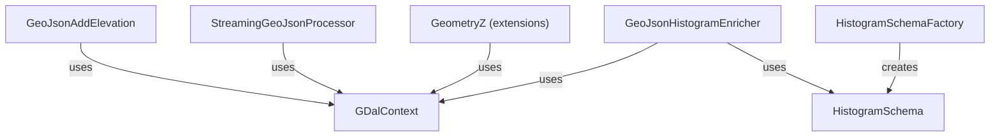

---
digest:
  local-classes:
    Program:
      mtime: "2026-06-09T16:04:44Z"
      digest: "e1623107bf1d964a526b588adc259035fbc65d746201544be5e5926fddd0dbb9"
  folders: {}
---
# SpocWeb.GeoJson.Raster


Adds elevation information from Digital Elevation Models (DEM) to GeoJSON files,
and computes per-feature elevation histograms using GDAL raster datasets
such as the Copernicus DEM VRT.

## Architecture



## Classes

| Class | Responsibility |
|---|---|
| [Program](Program.cs) | Entry point placeholder for the SpocWeb. |

## Relationships



## Entry Points

| Method | Description |
|---|---|
| `GeoJsonAddElevation.AddElevationAsZ(vrtFile, geoJsonDirectory)` | Adds Z coordinates to all GeoJSON files in a directory tree, updating each file in-place. |
| `StreamingGeoJsonProcessor.StreamGeoJsonProcessor(vrtPath, geoJsonPath)` | Streams elevation-enriched GeoJSON output for a single file without loading it fully. |
| `GeoJsonHistogramEnricher.AddHistogram(vrtFile, geoJsonDirectory)` | Adds compact elevation histograms to all GeoJSON polygon features in a directory tree in parallel. |
| `HistogramSchemaFactory.CreateFromRange(id, min, max, bucketCount)` | Creates a histogram schema from explicit min/max bounds and bucket count. |
| `HistogramSchemaFactory.CreateFromWidth(id, min, bucketCount, width)` | Creates a histogram schema from a starting value and fixed bucket width. |

## Quick Start

```csharp
// 1. Create a histogram schema (elevation −100 m to +9 000 m, 360 bins of 25 m each).
var schema = HistogramSchemaFactory.CreateFromWidth(
    "Elevation0-9000", -100, 360, 25);

// 2. Add Z elevation to all GeoJSON files in a directory tree.
GeoJsonAddElevation.AddElevationAsZ(
    @"D:\Copernicus_DSM\global_dem.vrt",
    @"D:\GeoData\Continent");

// 3. Add per-feature elevation histograms in parallel.
GeoJsonHistogramEnricher.AddHistogram(
    @"D:\Copernicus_DSM\global_dem.vrt",
    @"D:\GeoData\Continent");
```

## Key Concepts

### Elevation Z enrichment
[GeoJsonAddElevation](raster/GeoJsonAddElevation.cs) iterates every GeoJSON file in a directory,
reads the geometry, samples the raster at each coordinate via
[GDalContext.Sample](raster/GDalContext.cs),
and appends a Z value rounded to four decimal places.
[StreamingGeoJsonProcessor](raster/StreamingGeoJsonProcessor.cs) does the same
token-by-token to keep memory use constant regardless of file size.

### Raster sampling
[GDalContext](raster/GDalContext.cs) encapsulates one GDAL `Dataset` and `Band`,
together with the affine geo-transform matrix and an OSR coordinate transformation.
Each worker thread holds its own `GDalContext` (thread-safe, lock-free reads after open).
The static `GdalLock` serializes the non-thread-safe `Gdal.Open` call.

### Histogram computation
[GeoJsonHistogramEnricher](raster/HistogramSchema.cs) rasterizes each polygon's
bounding box, applies point-in-polygon tests via
`IndexedPointInAreaLocator`, and accumulates raster pixel counts or
spherical-area sums into a `long[]` or `double[]` array indexed by bin.
The schema ([HistogramSchema](raster/HistogramSchema.cs)) carries the bin definitions
and is shared across all parallel workers.

### Coordinate extension
[GeometryZ](raster/GeometryZ.cs) provides extension methods over the full
`NetTopologySuite` geometry hierarchy (`Point`, `LineString`, `Polygon`,
`Multi*`, `GeometryCollection`), dispatching via `switch` expression.

## Further Reading

- [GDAL VRT Format](https://gdal.org/drivers/raster/vrt.html) — virtual raster tiles used as the DEM source.
- [Copernicus DEM](https://spacedata.copernicus.eu/collections/copernicus-digital-elevation-model) — elevation model used in the test cases.
- [NetTopologySuite](https://github.com/NetTopologySuite/NetTopologySuite) — .NET geometry library used for all spatial operations.
- [OSGeo.GDAL NuGet](https://www.nuget.org/packages/GDAL) — managed bindings to GDAL/OGR/OSR.

## Subsystems

| Folder | Domain Role |
|---|---|
| [`raster/`](raster/ReadMe.md) | GDAL-backed raster processing classes for elevation enrichment and histogram computation. |
