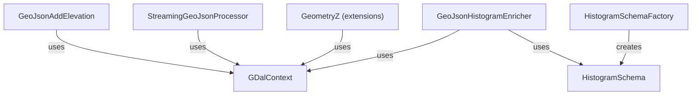

# SpocWeb.GeoJson.Raster

<!-- digest-map
local-classes:
  GDalContext: mtime=2026-04-20T16:33:28Z digest=dc2c111eaa794b356a1cad08948bb30fed2f2e2f0c90e9375caab34f268588a0
  Epsg: mtime=2026-04-20T16:33:28Z digest=dc2c111eaa794b356a1cad08948bb30fed2f2e2f0c90e9375caab34f268588a0
  GeoJsonAddElevation: mtime=2026-05-16T07:12:22Z digest=0f6a243ef484d835e4f85a9818515c4f8d14061e91e82aff94546b2b55fa4684
  GeoJsonHistogramEnricher: mtime=2026-05-04T19:51:06Z digest=ad370b8549690c526772074b2919bc6c31c75b6aff07686962a6f911cb882fc1
  GeometryZ: mtime=2026-04-18T14:41:04Z digest=748286817e01994ab7231a86addf5d776442f03c95ca4f8ec034cacb079f929d
  HistogramBin: mtime=2026-05-04T19:51:06Z digest=ad370b8549690c526772074b2919bc6c31c75b6aff07686962a6f911cb882fc1
  HistogramSchema: mtime=2026-05-04T19:51:06Z digest=ad370b8549690c526772074b2919bc6c31c75b6aff07686962a6f911cb882fc1
  HistogramSchemaFactory: mtime=2026-05-04T19:51:06Z digest=ad370b8549690c526772074b2919bc6c31c75b6aff07686962a6f911cb882fc1
  Program: mtime=2026-04-18T09:57:08Z digest=e3b0c44298fc1c149afbf4c8996fb92427ae41e4649b934ca495991b7852b855
  StreamingGeoJsonProcessor: mtime=2026-05-16T07:12:26Z digest=5e2569cea31bf06736224b64215e0f8bf743332cf15f2b3f10d73b9b212de291
folders:
folder_digest: 66464345559a961a566de61cf8e7865e22d4f8741a223ac279e7e3908a74048d
folder_mtime: 2026-05-16T07:12:26Z
-->

Adds elevation information from Digital Elevation Models (DEM) to GeoJSON files,
and computes per-feature elevation histograms using GDAL raster datasets
such as the Copernicus DEM VRT.

## Classes

| Class | Responsibility | Key Collaborators |
|---|---|---|
| `GDalContext` | Worker-local GDAL and coordinate-transformation context for safe parallel raster sampling. | `GeometryZ`, `GeoJsonHistogramEnricher`, `GeoJsonAddElevation` |
| `GeoJsonAddElevation` | Adds elevation Z coordinates to every geometry in a GeoJSON file using a GDAL raster model. | `GDalContext`, `GeometryZ` |
| `StreamingGeoJsonProcessor` | Low-memory streaming processor that adds Z coordinates to GeoJSON FeatureCollections token-by-token. | `GDalContext`, `GeometryZ` |
| `GeometryZ` | Extension methods that add the Z dimension from an elevation model to any `NetTopologySuite` geometry type. | `GDalContext` |
| `HistogramBin` | Value record describing one bin of a histogram (index, min/max values, label). | `HistogramSchema` |
| `HistogramSchema` | Shared histogram bin definition shared across all features in a processing run. | `GeoJsonHistogramEnricher` |
| `HistogramSchemaFactory` | Creates `HistogramSchema` instances from a range or a width specification. | `HistogramSchema` |
| `GeoJsonHistogramEnricher` | Enriches GeoJSON polygon features with compact per-feature elevation histograms derived from a DEM VRT. | `GDalContext`, `HistogramSchema` |

## Relationships

## Entry Points

| Method | Description |
|---|---|
| `GeoJsonAddElevation.AddElevationAsZ(vrtFile, geoJsonDirectory)` | Adds Z coordinates to all GeoJSON files in a directory tree, updating each file in-place. |
| `StreamingGeoJsonProcessor.StreamGeoJsonProcessor(vrtPath, geoJsonPath)` | Streams elevation-enriched GeoJSON output for a single file without loading it fully. |
| `GeoJsonHistogramEnricher.AddHistogram(vrtFile, geoJsonDirectory)` | Adds compact elevation histograms to all GeoJSON polygon features in a directory tree in parallel. |
| `HistogramSchemaFactory.CreateFromRange(id, min, max, bucketCount)` | Creates a histogram schema from explicit min/max bounds and bucket count. |
| `HistogramSchemaFactory.CreateFromWidth(id, min, bucketCount, width)` | Creates a histogram schema from a starting value and fixed bucket width. |
