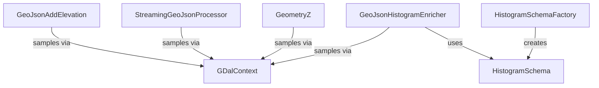

# raster

GDAL-backed raster processing classes for elevation enrichment and histogram computation.
All classes reside in the `org.SpocWeb.root.files.Tests.raster` namespace.

## Classes

| Class | Responsibility | Key Collaborators |
|---|---|---|
| [GDalContext](GDalContext.cs) | Worker-local GDAL dataset, raster band, geo-transform, and coordinate-transformation context. Manages thread-safe access via `GdalLock`. | `GeometryZ`, `GeoJsonHistogramEnricher`, `GeoJsonAddElevation` |
| [GDalContext.Epsg](GDalContext.cs) | Nested enum of common EPSG CRS codes (WGS 84, Web Mercator, ETRS89 UTM zones). | `GDalContext` |
| [GeoJsonAddElevation](GeoJsonAddElevation.cs) | Adds elevation Z coordinates to every geometry in a GeoJSON file using an in-memory or streaming approach. | `GDalContext`, `GeometryZ` |
| [StreamingGeoJsonProcessor](StreamingGeoJsonProcessor.cs) | Token-by-token streaming processor that enriches GeoJSON FeatureCollections with Z elevation without loading the full document. | `GDalContext`, `GeometryZ` |
| [GeometryZ](GeometryZ.cs) | Extension methods that dispatch over the full NTS geometry hierarchy to add the Z dimension from a raster model. | `GDalContext` |
| [HistogramBin](HistogramSchema.cs) | Value record describing one histogram bin: index, min/max bounds, interval notation and label. | `HistogramSchema` |
| [HistogramSchema](HistogramSchema.cs) | Shared histogram definition (id, unit, bucket count, bucket width, bin list) used across all parallel workers. | `GeoJsonHistogramEnricher`, `GDalContext` |
| [HistogramSchemaFactory](HistogramSchema.cs) | Factory that creates `HistogramSchema` instances from a min/max range or from a fixed bucket width. | `HistogramSchema` |
| [GeoJsonHistogramEnricher](HistogramSchema.cs) | Enriches GeoJSON polygon features with compact per-feature elevation histograms (counts or spherical areas) derived from a Copernicus DEM VRT. | `GDalContext`, `HistogramSchema` |

## Relationships

See also: parent project summary in [../ReadMe.md](../ReadMe.md).
