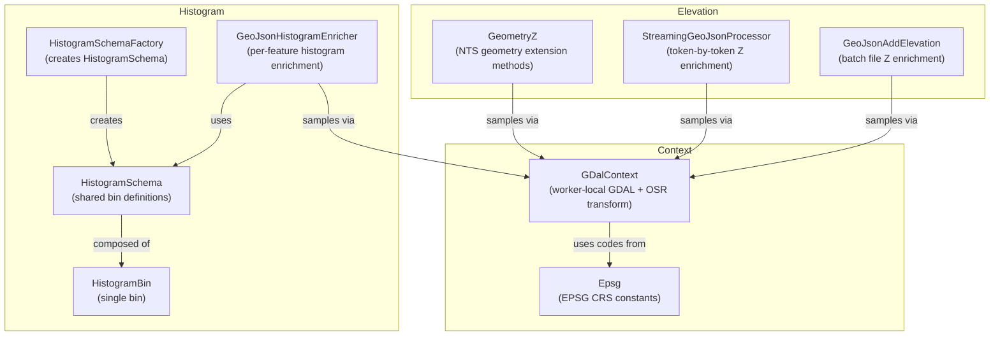
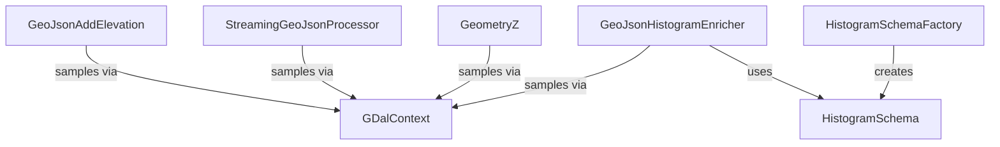

---
digest:
  local-classes:
    Epsg:
      mtime: "2026-06-09T16:04:44Z"
      digest: "f0b059edf4ecd00201a29f3f5dbb2243d34afb26183f7817d9f98a8f66eab7cc"
    GDalContext:
      mtime: "2026-06-09T16:04:44Z"
      digest: "94d99b71600bffef06ce57fb2054ad0062256bcf463c4e353e0cabcb52b53d93"
    GeoJsonAddElevation:
      mtime: "2026-06-09T16:04:44Z"
      digest: "e3d5aee25c27ec0452573f504d6449f46d05d59b0da14aae5142698b658872d3"
    GeoJsonHistogramEnricher:
      mtime: "2026-06-09T16:04:44Z"
      digest: "4ca284e0bb778ec17b33ab031b3d877c911a0ced1f6674ebda2f1ce23649c803"
    GeometryZ:
      mtime: "2026-06-09T16:04:44Z"
      digest: "614d471a784aba104c9923263832b3f0d34646572a31bf8e501e2fbf68cbb08d"
    HistogramBin:
      mtime: "2026-06-09T16:04:44Z"
      digest: "9bbda65e43164d84c53064634085f069774ae6079d0a0eec2db7b8eaab158e2a"
    HistogramSchema:
      mtime: "2026-06-09T16:04:44Z"
      digest: "edc3fe8bcc6412f74cb7d711b7b1783b23d2473a53fd1fe83684244f22b2d023"
    HistogramSchemaFactory:
      mtime: "2026-06-09T16:04:44Z"
      digest: "bfe761ccdca398e6e43f2ecbdab9e10dd8f42136b479b23a086aaf33adcacfc7"
    StreamingGeoJsonProcessor:
      mtime: "2026-06-09T16:04:44Z"
      digest: "ec6b0e56b414e0d88def3631b0599d4b8e5926f7f43037b56bc47d561860ce7e"
  folders: {}
---
# raster

GDAL-backed raster processing classes for elevation enrichment and histogram computation.
All classes reside in the `org.SpocWeb.root.files.Tests.raster` namespace.

## Architecture

## Classes

| Class | Responsibility |
|---|---|
| [GDalContext](GDalContext.cs) | Holds one worker-local GDAL and coordinate-transformation context for safe parallel processing. |
| [Epsg](GDalContext.cs) | common EPSG coordinate reference system codes used by the application. |
| [GeoJsonAddElevation](GeoJsonAddElevation.cs) | Adds elevation (Z) coordinates to every geometry in a GeoJSON file,  reading height values from a GDAL raster model such as a Copernicus DEM VRT. |
| [GeometryZ](GeometryZ.cs) | Adds z-Component to a Geometry |
| [HistogramBin](HistogramSchema.cs) | (shared) histogram bin definition. |
| [HistogramSchema](HistogramSchema.cs) | shared histogram schema used by all features. |
| [HistogramSchemaFactory](HistogramSchema.cs) |  |
| [GeoJsonHistogramEnricher](HistogramSchema.cs) | Enriches GeoJSON polygon features with compact per-feature histograms derived from a Copernicus DEM VRT or tile directory. |
| [StreamingGeoJsonProcessor](StreamingGeoJsonProcessor.cs) | Low-memory streaming processor that adds elevation Z coordinates to GeoJSON FeatureCollections  by reading and writing the JSON token-by-token without loading the entire document into memory. |

## Relationships

See also: parent project summary in [../ReadMe.md](../ReadMe.md).
