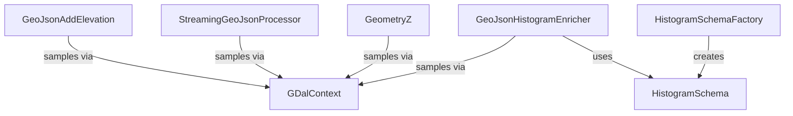

# raster

GDAL-backed raster processing classes for elevation enrichment and histogram computation.
All classes reside in the `org.SpocWeb.root.files.Tests.raster` namespace.

## Architecture

## Classes

| Class | Responsibility |
|---|---|
| [GDalContext](GDalContext.cs) | Holds one worker-local GDAL and coordinate-transformation context for safe parallel processing. |
| [Epsg](GDalContext.cs) | common EPSG coordinate reference system codes used by the application. |
| [GeoJsonAddElevation](GeoJsonAddElevation.cs) | Adds elevation (Z) coordinates to every geometry in a GeoJSON file,  reading height values from a GDAL raster model such as a Copernicus DEM VRT. |
| [GeometryZ](GeometryZ.cs) | Adds z-Component to a Geometry |
| [HistogramBin](HistogramSchema.cs) | (shared) histogram bin definition. |
| [HistogramSchema](HistogramSchema.cs) | shared histogram schema used by all features. |
| [HistogramSchemaFactory](HistogramSchema.cs) | Creates HistogramSchema definitions from an explicit bucket width or value range. |
| [GeoJsonHistogramEnricher](HistogramSchema.cs) | Enriches GeoJSON polygon features with compact per-feature histograms derived from a Copernicus DEM VRT or tile directory. |
| [StreamingGeoJsonProcessor](StreamingGeoJsonProcessor.cs) | Low-memory streaming processor that adds elevation Z coordinates to GeoJSON FeatureCollections  by reading and writing the JSON token-by-token without loading the entire document into memory. |

## Relationships

See also: parent project summary in [../ReadMe.md](../ReadMe.md).
